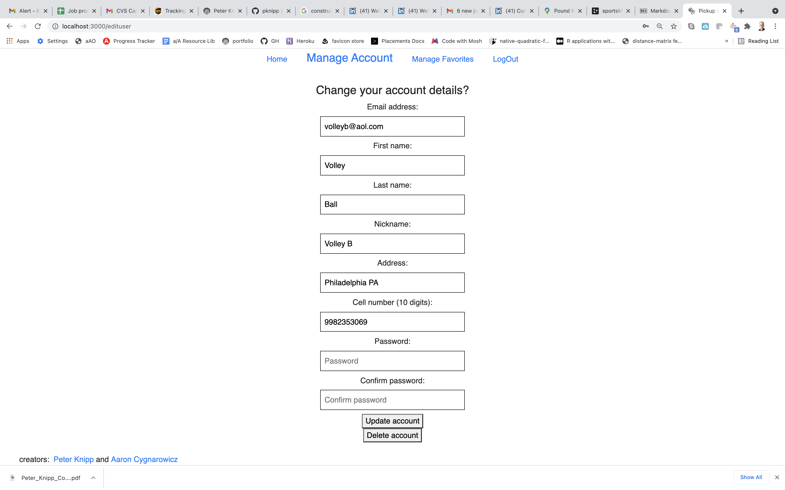
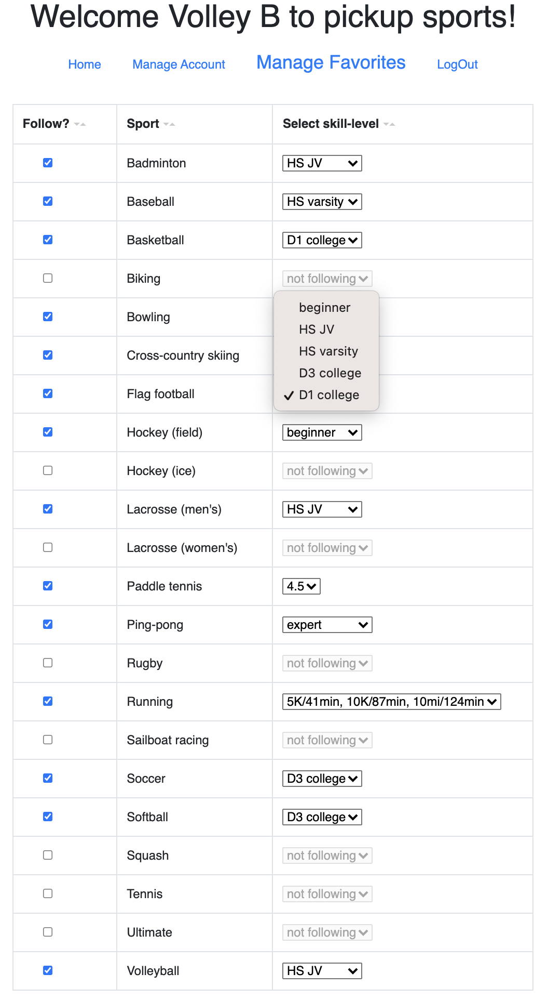
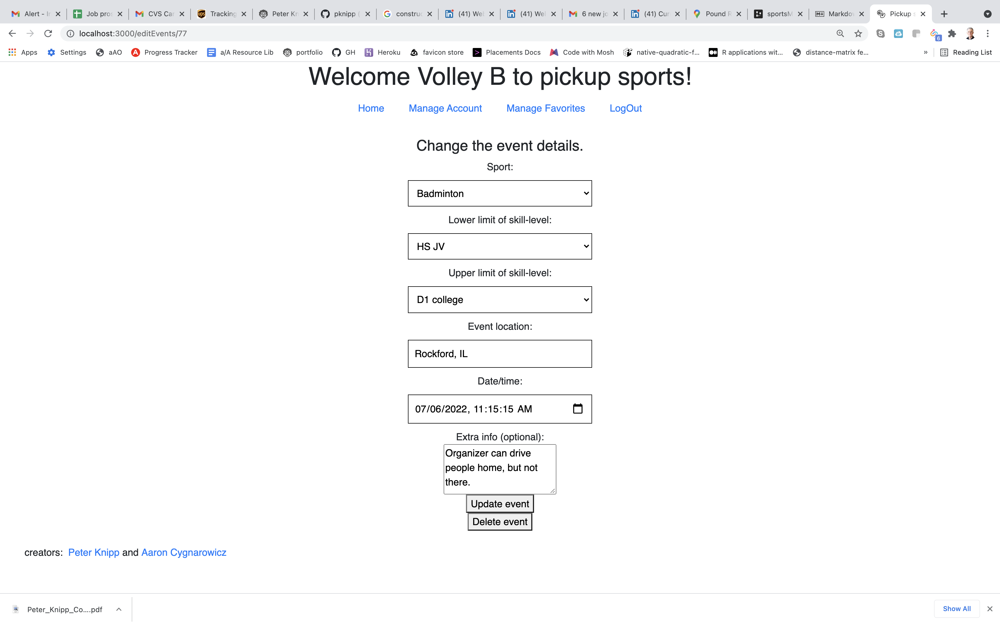
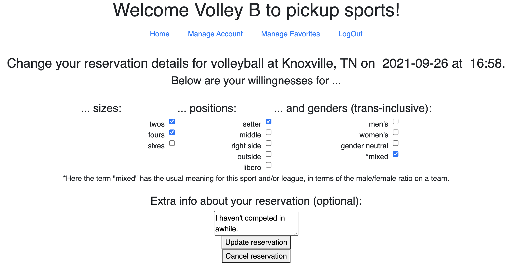
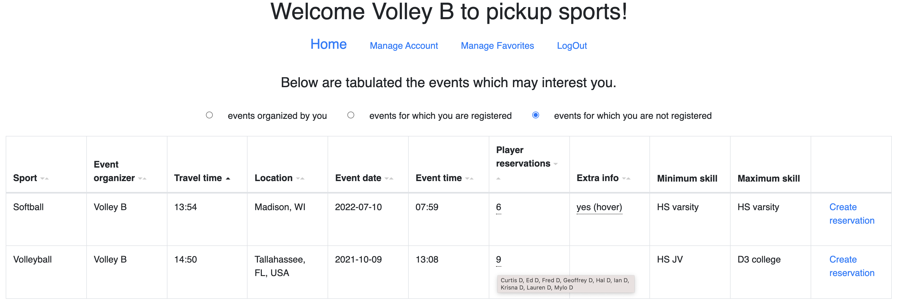

# Contents

[Heroku deployment](https://pickup-sports-events.herokuapp.com)

[Schema](https://drawsql.app/appacademy-2/diagrams/sportsmeetup)

[Introduction](#introduction)

[Tables](#tables)

[Google Maps' Distance-Matrix API](#google-maps-distance-matrix-api)

[Base-2 encoding/decoding of Reservation willingnesses](#base-2-encoding-and-decoding-of-reservation-willingnesses)

# Introduction

[return to "Contents"](#contents)

[go to next section ("Tables")](#tables)

Our project (["Pickup sports"](https://pickup-sports-events.herokuapp.com)) facilitates the process by which [informal sporting events](https://en.wikipedia.org/wiki/Pick-up_game) (games, training sessions, etc) are organized.  Rather than relying a myriad of often uncorrelated networks of friends and sports enthusiasts to exchange information/suggestions/commitments via phone, email, postings, and social media, this provides a central location for over twenty sports, nationwide.  Any User may create and organize an Event for any Sport that is one of their Favorites, and any User may signup (aka create a Reservation) in this Event (as long as the Event's Sport is one of their Favorites).  The front-end of our project uses JavaScript, Bootstrap, and React with functional components.  We manage front-end state with hooks and context.  Our back-end uses PostgreSQL, Node, Express, Sequelize, and the Google Maps Distance-Matrix API.

# Tables

[return to "Contents"](#contents)

[return to previous section ("Introduction")](#introduction)

[go to next section ("Google maps distance-matrix API")](#google-maps-distance-matrix-api)

Our database has five tables: Users, Sports, Favorites, Events, and Reservations, some details about each of which appear below.

## Users:

This table has no foreign keys (FKs).

User.tokenId is truthy only for Users that are logged in.

Below is a screenshot of the front-end component "User" which allows the User CRUD access to this table.



## Sports:

This table has no FKs.

One column ("nGenders") is an integer between 0 and 4 which represents the number of different ways that one may typically arrange teams based on gender: "men's", "women's", "gender-neutral", or "mixed".  The latter designation applies to some sports and/or leagues for which there are generally understood ways for constructing teams heterogeneously by gender.  For most rows, Sport.nGenders equals 4, but some exceptions are provided below:
- 0 (ie, no needs to extra gender classification): Lacrosse (men's), Lacrosse (women's)
- 3 (ie, no "mixed" category): Biking, Cross-country skiinng, Running

Two columns ("Skills" and "boolTypes") are JSON.stringifications of non-primitive data types, as indicated below:

### - Sport.Skills:

This is an array of skill-level strings.  Below are examples for several sports.  (Code is taken from db/seederData/sports.js.)
```
{ Name: "Biking", Skills: [8,10,12,14,16,18,20,22].map(x => String(x) + "MPH") },
{ Name: "Tennis", Skills:["1.5","2.0","2.5","3.0","3.5","4.0","4.5","5.0","5.5","6.0","6.5","7.0"]},
{ Name: "Ultimate", Skills: ['beginner', 'intermediate', 'advanced', 'expert'] },
{ Name: "Volleyball", Skills: ["beginner", "HS JV", "HS varsity", "D3 college", "D1 college"] }
```
### - Sport.boolTypes:

This is a POJO of arrays of boolean questions posed at the reservation phase.  An example for Basketball is presented below.  (Code taken from db/seederData/sports.js.)
```
{
    ["team sizes"]: ["3 on 3", "5 on 5"],
    positions: ["center", "forward", "guard"],
},
```
Keys for other boolTypes properties are given below, each followed by the Sports for which it is used.
- "distances": running, biking, cross-country skiing
- "types": bowling, sailboat racing
- "sizes and positions": tennis, paddle tennis

Values of both Sport.Skills and Sport.boolTypes are JSON.parsed immediately after querying from the database and are JSON.stringified immediately before committing to the database.

Sports is the only read-only table.  A future expansion of this project would allow users to POST/PUT/DELETE rows of the Sports table.  We envision doing this by adding a boolean column isCommissioner to the Favorites table.
For any row of the Favorites table with a true value of that boolean, that User will be able to mutate that Sport.  (Note that more than one User could have this privilege, for any given sport.)

## Favorites:

Because any User is interested in following (aka "organizing" or "participating in") only a subset of the rows of the Sports table, there is a many-to-many relationship between those two tables.  The Favorites table joins those two tables.

The only non-FK column of this table is "Skill", an integer which represents the User's self assessed skill-level in that Sport, ie would equal an appropriate index of Sport.Skills.  (See "Sports" above for various skill-level scales.)

Below is a screenshot of the front-end component "Manage Favorites" which allows the User CRUD access to this table.  (Note that one of the drop-downs is activated.)



##  Events:

  An Event (our name for a game, practice, or training session) may be organized only by a User for whom that Sport is a Favorite, so the Events table depends upon the Favorites table.

  <!-- WRONG! Note that Event.userId is the PK for the event organizer, not for a player in the Event (which is handled by the Reservations table). -->

  The "Minimum skill" and "Maximum skill" columns contain integer values, each defining the Event organizer's desired limiting skill-level for the particular event.  As for Favorite.Skill, these two integers acquire their meaning when used as indices for the array Sport.Skills, for that particular sport.

  Below is a screenshot of the front-end component "EditEvent" which allows the User CRUD access to this table.



## Reservations:

 There is a many-to-many relationship between Events and Users (when the latter's row represents an Event's player rather than an Event's organizer), so these tables are joined by the Reservations table.

The only non-FK column of this table is "boolVals".
This is the JSON.stringification of a flat POJO, each of whose properties corresponds to an array of checkboxes ("preferences"/"willingnesses") filled out by the User in the Reservation process.  (See boolTypes above for more information for the names of these checkboxes.) The value of each of these properties is a integer: the base-2 encoding of the User's responses.  As for the two columns of stringifications in the Sports table, values of Favorite.boolVals
are JSON.parsed immediately after querying from the database and are JSON.stringified immediately before committing to the database.

Below is a screenshot of the front-end component "EditReservation" which allows the User CRUD access to this table.



# Google Maps Distance-Matrix API

[return to "Contents"](#contents)

[return to previous section ("Tables")](#tables)

[go to next section ("Base-2 encoding and decoding of Reservation willingnesses")](#base-2-encoding-and-decoding-of-reservation-willingnesses)

The API's main purpose in our project is to enable the User to know the travel time between his/her address and that of a particular Event. For instance when the User views all of the Events for which he/she may make a Reservation, that table may be sorted by the values in that column, as is the case in the screenshot of the "Home" component below. (Note that this screenshot also shows an activated "Tooltip" indicating the Nicknames of the 11 Users who have made Reservations for the Garland football game.)



For a given origin/destination pair this API returns travel distance and travel duration but no information about the route details.  The url for a typical GET request from this API follows:
```
https://maps.googleapis.com/maps/api/distancematrix/json?origins=1600+Pennsylvania+Avenue+NW+Washington+DC&destinations=Pittsburgh|Disney World|Honolulu&key=OUR_KEY_GOES_HERE
```
In this case, there is one origin (the White House) and three destinations (Pittsburgh, Disney World, and Honolulu).  The destination addresses are separated by the "|" symbol, and the response follows:
```
{
   "destination_addresses" : [ "Pittsburgh, PA, USA", "Orlando, FL, USA", "Honolulu, HI, USA" ],
   "origin_addresses" : [ "1600 Pennsylvania Avenue NW, Washington, DC 20500, USA" ],
   "rows" : [
      {
         "elements" : [
            {
               "distance" : {
                  "text" : "393 km",
                  "value" : 393287
               },
               "duration" : {
                  "text" : "3 hours 57 mins",
                  "value" : 14199
               },
               "status" : "OK"
            },
            {
               "distance" : {
                  "text" : "1,388 km",
                  "value" : 1388284
               },
               "duration" : {
                  "text" : "12 hours 23 mins",
                  "value" : 44585
               },
               "status" : "OK"
            },
            {
               "status" : "ZERO_RESULTS"
            }
         ]
      }
   ],
   "status" : "OK"
}
```
  Note that this API can handle precise addresses (like that of the White House, above), incomplete/vague addresses ("Pittsburgh"), or those of locations to/from which it is impossible to drive ("Honolulu").  Our seeder data for the values of User.Address and Event.Location have been sanitized to include only the names of cities accessible by car from the majority of places in the contiguous United States.

  Our back-end's POST/PUT routes for the Users and Events table allow for the inclusion of new addresses in the database, and we sanitize each of these changes by confirming that the distance-matrix API can find a route between New York City and User.address or Event.location.
  <!-- We also alert the User to the fact that the API returns the API's version of the address, to allow the User to detect whether or not the API is misinterpreting the address entered by the user. -->
  Below is api/routes/checkLocation.js, which performs this task for the aforementioned routes.:
  ```
const fetch = require('node-fetch');
const { mapsConfig: { mapsApiKey } } = require('../../config');

const checkLocation = async LocationIn => {
    const response = await fetch(`https://maps.googleapis.com/maps/api/distancematrix/json?origins= ${LocationIn}   destinations=New+York+NY&key=${mapsApiKey}`);
    let data = await response.json();
    let success = response.ok && data.status === "OK" && data.rows[0].elements[0].status === "OK";
    let Location = success ? data.origin_addresses[0] : LocationIn;
    return {Location, success};
}
module.exports = checkLocation;
  ```

<!-- ## player/owner dichotomy? -->

# Base-2 encoding and decoding of Reservation willingnesses

[return to "Contents"](#contents)

[return to previous section ("Google Maps' distance-matrix API")](#google-maps-distance-matrix-api)

The code below is taken from an event handler in the EditReservation component, showing how an array of booleans generated by checkboxes are encoded into a single integer, whose value equals reservation.boolVals[boolType].
```
const handlePutPost = async e => {
    e.preventDefault();
    // Encoding the arrays of booleans is done one boolean type at a time.
    Object.entries(boolTypes).forEach(([boolType, bools]) => {
        // Each booleanType's responses are encoded as ("reduced into") a base-2 integer (#.boolVals).
        reservation.boolVals[boolType] = [...bools].reverse().reduce((tot, bool) => {
            // Number(...) converts boolean (F/T) to a bit (0/1), which then supplements the accumulator
            return 2 * tot + Number(bool[1]);
        }, 0);
    });
    // A warning is generated if the user selects no checkboxes for any single boolean type.
    let haveNoBools = Object.values(reservation.boolVals).reduce((sum, value) => sum + Number(!value), 0);
    let newMessage = !haveNoBools ? '' :
        "You need to select at least one checkbox from " + haveNoBools + " of the groups above.";
    if (newMessage) return setMessage(newMessage);
```
The code below is taken from the useEffect in EditReservation, where it shows how the integer newReservation.boolVals[boolType] fetched from the database is decoded into an array of boolean values newBoolTypes[boolType]. This POJO is eventually put into state.
```
// "Genders" booleans come from context (from App component), whereas the other booleans are fetched from db.
let newBoolTypes = {genders: genders.slice(0, newReservation.nGenders), ...newReservation.event.boolTypes};
// Decode base-2 integer in db to determine boolean array for each boolType.
Object.entries(newBoolTypes).forEach(([boolType, bools]) => {
    bools.forEach((bool, i) => {
        // The rightmost bit is used to determine the present boolean.
        const boolVal = newReservation.boolVals[boolType] % 2;
        // !!converts a bit into a boolean.
        bools[i] = [bool, !!boolVal];
        // Subtract the rightmost bit from the integer (leaving 0 as the last bit).
        newReservation.boolVals[boolType] -= boolVal;
        // Dividing the integer by two serves to remove the rightmost bit (a zero).
        newReservation.boolVals[boolType] /= 2;
    })
});
setBoolTypes(newBoolTypes);
setReservation(newReservation);
```
Below is the React code in this component which shows how the values of boolTypes are used to pre-fill the checkboxes.
```
{/* Create the checkboxes one boolType at a time. */}
{Object.entries(boolTypes).reverse().map(([boolType, boolArray], index1) => (
    <div key={boolType}><br/>
        <div>
            <h4>
                ...
                {/* The following ternary only makes the grammar proper. */}
                {index1 && index1 === Object.keys(boolTypes).length - 1 ? " and " : " "}
                {/* The following controls the appearance of this helpful point, for one boolean type. */}
                {boolType}{boolType === "genders" ? " (trans-inclusive)" : ""}
                :
            </h4>
        </div>
        {boolArray?.map((bool, index2) => (
            <div key={index2} className="checkboxPair">
                {/* label for the checkbox */}
                <span>{bool[0]}</span>
                <input
                    type="checkbox"
                    // value for the checkbox
                    checked={bool[1]}
                    onChange={e => {
                        // easy way to make a deep clone
                        const newBoolTypes = JSON.parse(JSON.stringify(boolTypes));
                        // change value in deep clone, and then overwrite state
                        newBoolTypes[boolType][index2][1] = e.target.checked;
                        setBoolTypes(newBoolTypes);
                    }}
                />
            </div>
        ))}
    </div>
))}
{reservation.nGenders < 4 ? null :
  '(Here the term "mixed" has the usual meaning for this sport and/or league, in terms of the male/femaratio on a team.)'
}
```

We hope that you enjoy your pickup-sports event.  Exercise is important for the body AND the mind!
